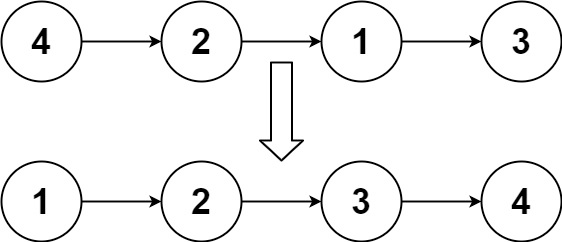
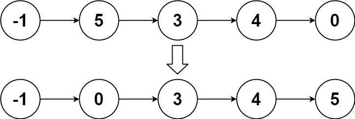

# 描述

给你链表的头结点 head ，请将其按 升序 排列并返回 排序后的链表 。

# 示例

示例一

```text
输入：head = [4,2,1,3]
输出：[1,2,3,4]
```

示例二


```text
输入：head = [-1,5,3,4,0]
输出：[-1,0,3,4,5]
```

示例三
```text
输入：head = []
输出：[]
```

# 提示

- 链表中节点的数目在范围 [0, 5 * 10^4] 内
- -10^5 <= Node.val <= 10^5