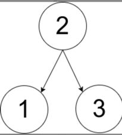
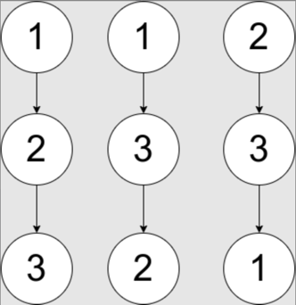

## 描述

给你一个数组pairs ，其中pairs[i] = [xi, yi]，并且满足：

pairs中没有重复元素
xi < yi
令ways为满足下面条件的有根树的方案数：

树所包含的所有节点值都在 pairs中。
一个数对[xi, yi] 出现在pairs中当且仅当xi是yi的祖先或者yi是xi的祖先。
注意：构造出来的树不一定是二叉树。
两棵树被视为不同的方案当存在至少一个节点在两棵树中有不同的父节点。

请你返回：

如果ways == 0，返回0。
如果ways == 1，返回 1。
如果ways > 1，返回2。
一棵 有根树指的是只有一个根节点的树，所有边都是从根往外的方向。

我们称从根到一个节点路径上的任意一个节点（除去节点本身）都是该节点的 祖先。根节点没有祖先。


##示例
示例 1：



```
输入：pairs = [[1,2],[2,3]]
输出：1
解释：如上图所示，有且只有一个符合规定的有根树。
```
示例 2：



```
输入：pairs = [[1,2],[2,3],[1,3]]
输出：2
解释：有多个符合规定的有根树，其中三个如上图所示。
```
示例 3：
```
输入：pairs = [[1,2],[2,3],[2,4],[1,5]]
输出：0
解释：没有符合规定的有根树。
```

## 提示

- `1 <= pairs.length <= 10^5`
- `1 <= xi < yi <= 500`
- `pairs中的元素互不相同`


>来源：力扣（LeetCode）  
链接：https://leetcode-cn.com/problems/number-of-ways-to-reconstruct-a-tree  
> 著作权归领扣网络所有。商业转载请联系官方授权，非商业转载请注明出处。