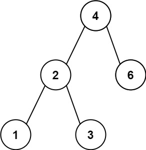
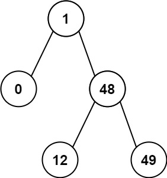

# 描述
给你一个二叉搜索树的根节点 root ，返回 树中任意两不同节点值之间的最小差值 。

差值是一个正数，其数值等于两值之差的绝对值。

# 示例

示例 1：



```shell
输入：root = [4,2,6,1,3]
输出：1
```

示例 2



```shell
输入：root = [1,0,48,null,null,12,49]
输出：1
```

# 提示

- 树中节点数目在范围 [2, 100] 内
- 0 <= Node.val <= 10^5
