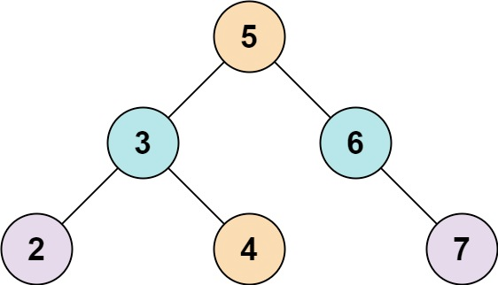
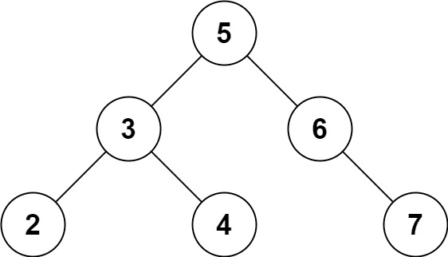

## 描述
给定一个二叉搜索树 root 和一个目标结果 k，如果 BST 中存在两个元素且它们的和等于给定的目标结果，则返回 true。

## 示例
示例 1：



```
输入: root = [5,3,6,2,4,null,7], k = 9
输出: true
```
示例 2：



```
输入: root = [5,3,6,2,4,null,7], k = 28
输出: false
```

## 提示

- 二叉树的节点个数的范围是[1, 10^4].
- `-10^4<= Node.val <= 10^4`
- root为二叉搜索树
- `-10^5<= k <= 10^5`


>来源：力扣（LeetCode）  
链接：https://leetcode-cn.com/problems/two-sum-iv-input-is-a-bst  
著作权归领扣网络所有。商业转载请联系官方授权，非商业转载请注明出处。